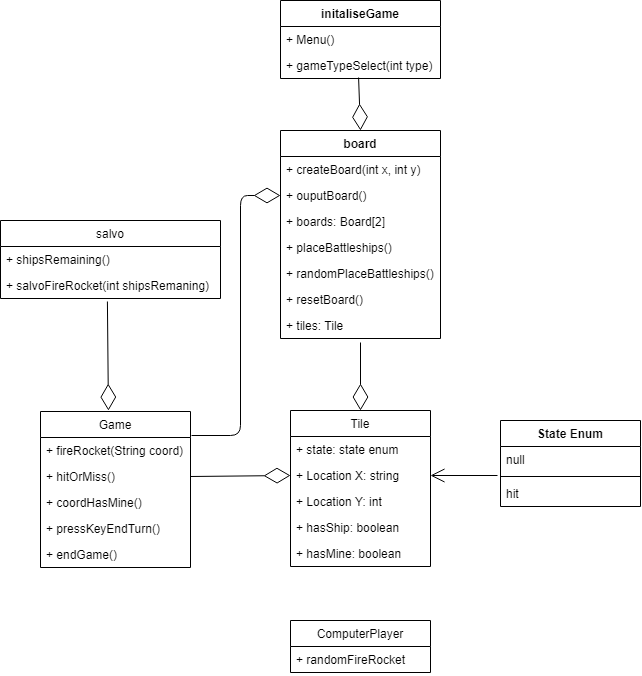
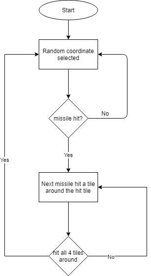
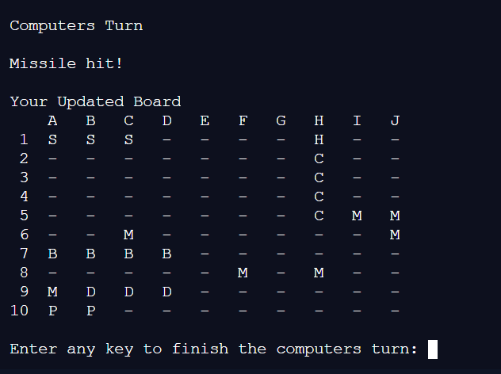
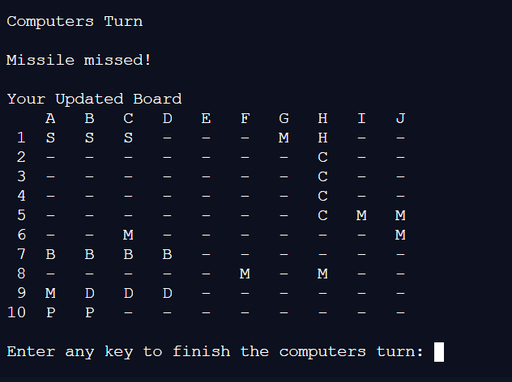
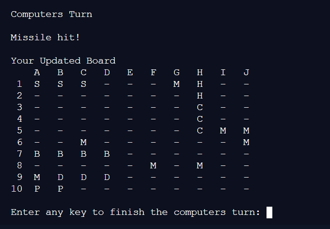
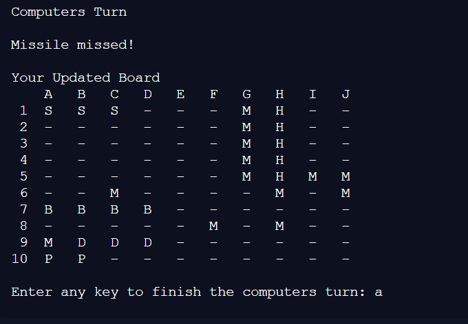

# AdaShip

Replit link : https://replit.com/join/qnxvagko-emilybuck
github link: https://github.com/emilybuc/AdaShip


## Challenge Outline

### Summary and review of the problem, overall proposed solution

We should design and develop a battleships game in an object-orientated way. Battleships is a simple game of placing ships of differing sizes onto a board. Your opponent then shoots at your board, and the first person to sink all of their opponent’s ships wins.

In the simple game, you only get one shot per turn but in the salvo variation of battleships, you get a missile per ship left unsunk.

The mine version of the game places random mines around the board, if your opponent hits a mine with a missile, then the surrounding 8 tiles will also get hit.

I should also set up a computer player who will shoot at my board if it is one player versus a computer game, the computer player needs to be able to place their ships automatically and shoot at the player’s board.

When taking user input there needs to be validation on where boats can be placed and where shots can be taken (i.e within the board).

My solution is to create two classes, the first of which will be 'Game' that will include functions such as the one to fire missiles, whether or not the missile has hit.

The second class will be a board class to create the board, output the board and place the boats.

I also want a struct - one that stores data about what is in the coordinate of the board (whether or not its been hit, if it has a boat or a mine) I will call this struct tile.

I also want a file with functions about salvo mode, they will count the number of boats left and a function that fires missiles but takes an argument for the number of missiles.
 

### UML style diagram illustration initial overall solution



### Initial working plan, overall approach, development strategy and approach to quality

My initial working plan was to start off getting the data from the config file and inputting it into two classes, a boat and a board class, as both of these need to maintain state. It will also allow me to instantiate two instances of each of these classes for the one and two-player boards (or computer). The board class will allow me to keep the state of each of the players' boards and perform actions against them. For example, the board class will keep the state of where the players boats are and where missiles have hit on their board.

My overall approach is to create as many functions are reusable, especially in the board class as this class will be used to place ships onto the board and be used to fire missiles at the board. I decided that the board would own all of this functionality and not a game class as the board is where the state of the game is kept.

The development strategy is to get functions working and usable before implementing more efficient versions, I will constantly test my code to check for bugs and inconsistencies. Once I have finished an epic I will get one of the other apprentices to look at my code to check for their understanding. If they are unsure of what my code is doing or the variable names make it confusing to follow what my code is doing I will refactor it. The best-written code you can follow without any comments, the variable names should be self-explanatory and you should not have to reread a line more than once to understand what it is doing.

My approach to quality is to create focused functions that have descriptive names and only do one task. If I am trying to do a task more than once, for instance, converting a string into all upper case then I will separate this task into its own function. This will also make my code more readable as calling for a function called toUpper and passing in a string it is easier to understand what is happening.


### Analysis and decomposition of the overall problem into key epic style tasks

Analysis:

The most difficult epic will place the boats and taking the users input as this requires me to not only figure out a way to convert letters that the user inputs into numbers; but also find a way to break up the letters from the numbers in the single entry.

 

Epics:

Getting data from the config file and set-up of the board

Take users input and output a coordinate

Placing the boats

Gameplay setup - turn-based play and when the game has ended

Configurable board, changing how the coordinates are inputted to take excel style x coordinates

Salvo mode

Unlimited additional boats

Hidden mines

Improved computer targeting

 

### Initial Object orientated design ideas 

I want to store the state of the board so I want to have that inside of a class. Making the game a class is unneeded as it does not need to keep state itself. I will instead make a boat class to keep the state of the boats.

I will make sure I use encapsulation, ensuring to use getters and setters when wanting to change the state of private member variables.

I will also use inheritance so I can use my boat class inside of my board class, so my board class inherits the properties of the boat class and can access the boats that are being used for the game.

## Development

### Adoption and use of good standards

The main thing I will be doing is writing readable but efficient code, this is important as a whole function could be written on one line but nobody would understand what the function was doing so this would be a very poor standard to follow.

 

I will also have helper methods inside my functions, for example a function that sets the ship will have a helper function that checks if the space that the ship needs to go is free.

I should also try to avoid hard-coding as the number of ships may change and the size of the board.

When reading through my code I should also be mindful of code smells, this indicates that my code needs to be refactored, if a function is getting too large or if I am repeating lines these are indications that my code needs to be refactored.

 

### Development

tasks, code review and changes

 

Epic - Getting data from the config file and set-up of the board

 

Task - Using file stream to read from the adaship_config and validate whether the line contains the board details before writing those variables to a variable to be used in creating a 2d vector which will be how I hold the state of the board.

Code review: The comments made said I should access the fstream and get the board configuration from a helper function as the constructor was becoming too large.

Changes: I put the config into a helper function to be called by the constructor, once the member variable for the board had been set up I knew how large the board needed to be before creating the 3d vector.

 

Epic - Take users input and output a coordinate

Task - Using isdigit and isalpha functions to break the input string into two strings of numbers and letters, once I have done this I can convert them separately into coordinates for the board. I worked out that char can also be converted into a number, these numbers were  65 characters larger than the coordinate that they were referring to so I used this to work out the coordinate from the letter dynamically.

Code review: I had not implemented a way to take in two letters for the coordinate.

Changes: the changes that needed to be made from the code review will be implemented during the next implementation of the board resizing.

 

Epic - Placing the boats

Task - Using file stream to read from the adaship_config and validate whether the line contains a boat before writing those variables to a struct and placing them in a vector.

Task - How to figure whether there was a boat intersecting the boat I am currently placing or if it is partly off the board. I figured out that I needed to loop through and check the coordinates of the whole ship before placing it as I was getting partly placed ships.

 

Epic - Gameplay setup - turn-based play and when the game has ended

Task - Set up functions to be called to run different game modes

Task - Set up a menu to call these functions from.

Task - Use the random coordinates function to create the computer game play

Code Review Changes - I should create a menu function to call for the user to shoot the ships.

Changes: I broke out the computer shoot and player shoot functions as putting them together was confusing, it was a good idea to break them out though as I can now use them in other game mode functions.

 

Epic - Configurable board, changing how the coordinates are inputted to take excel style x coordinates

Task - outputting the board dynamically

Task - Taking in larger coordinates ie AA and BA

Code Review - change the name of the variable used to change the letter coordinates into number ones as its confusing what I was doing with the variable

Changes - I changed the variable to be called 'convertCharToCoord'

 

Epic - Salvo mode

Task - Create a function that counts up the number of boats still left on the board and returns an int of the number of boats left, I will then call for the shoot missile function as many times as there are boats left.

Code review - the way I am counting ships will not work when additional ships can be added

Changes - I could not make the changes to the function

 

Epic - Unlimited additional boats

Task - I had to add validation to check how many boats could fit onto a given board so they could not add in too many boats. I also added that the auto place function can only try and place a boat 100 times before it outputted a message saying it could not place any more boats. This is because the computer may not place the boats efficiently enough to fit them all on the board, this allows the game to carry on.

Code review - They noted that if the user did not efficiently place the boats then they would not be able to place the maximum  number of boats onto the board.

Changes - I added an option to the menu to stop placing boats so the user could use that if they can’t fit any more boats onto their board.

 

Epic - Hidden mines

Task - Add in a function to randomly place 5 mines onto the board

Task - Add the functionality to the missile function to check if there are mines on the tile that is hit

Task - Add a function to hit all tiles around the mine

Code review - Could add in the option to ask the user how many mines they wanted on the board

Changes - If I have the time I will implement this. 


Epic - Improved computer targeting

Task - Finding a way to store any previous hits

Task - Creating a function that will hit the 4 spots around a tile to see if it will hit another ship

Code Review - Looping through the coordinates from oldest to newest, I should do it the other way around

Changes - I started from the newest coordinates first so I can try to seek out boats easier.

 

 

### Ensuring quality through testing and resolving bugs

I test my code often and make sure to type in any erroneous inputs that the user may type in, like letters instead of numbers or very large inputs. This is called edge testing. This ensures my code is as robust as it can be.

I ran into a few bugs, including having swapped around the x and y coordinates at one point, which caused strange functionality.

Another bug caused boats to be placed even if some of it was outside the board or overlapping another boat, this was because my function places the ship one tile at a time and only checks on each tile so half of the boat would be placed, I then implemented a checking loop before actually placing it so I knew if the boat could be placed.

A bug that I didnt have enough time to fix was to create a different thread when calling to hit tiles around the mine. When a mine hits another mine it is calling the same function twice and because of the way its set up it will not work. So if a mine hits another mine the game stops running.

When reseting the board it also does not let you place ships you have already placed. The last major bug that I found was that when running salvo mode with more than 5 boats it will not count up the boats correctly because of the way I implemented the salvo mode. I was not able to fix this issue due to time constraints. 

### Reflection on key design challenges innovations and how I solved them

The main design challenges came with placing the boats as there were three elements I needed to consider when trying to place a boat, whether or not there is already a boat where the user is trying to place a new one, is some of the boat outside of the board and how do I take the users coordinate input and output a coordinate that my software can use.

The innovations that I came up with were to place a struct inside my 2d vector so I could manage the state of each tile, this made it easy to understand when reading my code if I was checking if there was a boat inside my tile.

The way I broke the input string into two strings before converting it made it so much simpler especially when dealing with double alpha characters.

I also had to come up with a few ways to stop users from being able to change the config to add in too many boats, my first solution was to check the area of the board and count up the number of tiles the boats occupied, if there were too many boats by area then exit the program. The second way was to allow the user to carry on with the game if they could not place all their ships. As it is almost impossible to place the boats in the perfect way to fit them onto the board they may not be able to place the last ships. With the auto place I implemented a retry 100 times before giving up placing a boat, I chose this large number to give the computer enough time to try to place it in the remaining space. If I did not do this the auto place ships would infinitely try and place the ships when there is no more space left.
 

 

## Evaluation

### Analysis with embedded examples of key code refactoring, reuse, smells

I refactored my validateInput function from:

```

bool validateInput(string input){

     int convertCharToCoord = 65;

     int convertIntToCoord = 48;

     for (int i = 0; i < input.size(); i++){

       if(isalpha(input[i])){

         cout << input[i] << endl;

         int uppercaseChar = toupper(input[i]);

         coordinates[0] += (uppercaseChar - convertCharToCoord);

       } else if(isdigit(input[i])){

         if(isdigit(input[i + 1])){

           int firstDigit = convertArrayToInt(input[i]) * 10;

           int secondDigit = convertArrayToInt(input[i + 1]);

           int finalNum = (firstDigit + secondDigit);

           coordinates[1] = finalNum - 1;

           break;

         } else {

           coordinates[1] = convertArrayToInt(input[i]) - 1;

         }

       } else {

         resetCoord();

         return false;

       }

     }

     cout << coordinates[0] << ", " << coordinates[1] << endl;

     if(validateCoord(coordinates)){

       return true;

     } else {

       resetCoord();

       return false;

     }

   }

```

To:

```

   bool validateInput(string input){

     int convertCharToCoord = 65;

     //if you minus 65 from a char you will get the coordinates on the board

     string xCoord, yCoord;

     for (int i = 0; i < input.size(); i++){

       if(isalpha(input[i])){

         xCoord += input[i];

         //if the character is a letter then add it to this string, im splitting up the letters from numbers

       } else if(isdigit(input[i])){

         yCoord += input[i];

         //if the character is a number add it to this string

       } else {

         resetCoord();

         //if theyve inputted a special character return false and tell the user to input a correct coordinate

         return false;

       }

     }

 

     int xCoordInt = 0;

     xCoord = convertToUpper(xCoord);

     //convert this to uppercase

 

     for (int i = 0 ; i < xCoord.length(); i++){ // loop through xCoord

       if(xCoord.length() == 1){ //if the input only as one alpha digit just convert to coordinate

         xCoordInt = (xCoord[i] - convertCharToCoord);

 

       } else if (xCoord.length() == 2){ // if the letter part of the coordinate is double digits

         switch (i){

           case 0: // loop through each character of the string

            if(xCoord[i] == 'A'){

              xCoordInt += 26; //if character 1 is an A then add 26 to get the coordinates

            } else if (xCoord[i] == 'B'){

              xCoordInt += 52; //if character 1 is an A then add 52 to get the coordinates

            } else if (xCoord[i] == 'C'){

              xCoordInt += 78; //if character 1 is an A then add 78 to get the coordinates

            }

             break;

           case 1:

             xCoordInt += (xCoord[i] - convertCharToCoord); //add the second character onto the first one to get the final coordinate

             break;

         }

       } else {

         return false; //if there is no alpha characters in the coordinate then it is incorrect

       }

     }

     coordinates[0] = xCoordInt; //set the x coordinate

     coordinates[1] = stoi(yCoord) - 1; // convert the number portion of the coordinate to a number and minus 1 to get the coordinate

 

     if(validateCoord(coordinates)){

       //validate the coordinate to check it hasnt got a boat and is inside the board

       return true;

     } else {

       resetCoord();

       //if not then reset the coordinate variable and return false

       return false;

     }

   }

```

This worked way better as instead of converting each digit into a number and trying to figure out when there was a double-digit, if I dealt with the number portion of the input as a string before converting it I wouldn’t have to worry about adding them together.

I was also able to reuse this function to place the boats as well as take a coordinate for where the user wanted to fire a missile as it checked all of the same parameters for both.

 

```

int getIntFromFile(stringstream& lineStream, char delimiter){

 string value;

 getline(lineStream, value, delimiter);

 //the value from before the delimiter

 int convertedToInt = stoi(value);

 //convert it to an int

 return convertedToInt;

}

```

I dealt with code smells like code being duplicated by refactoring and making helper functions if I was performing the same action more than once. The function above shows getting a line from a stringstream, assigning it to a variable and breaking it on a delimiter; once that was done I converted it into an integer. this function was performed on different classes multiple times so it made sense to make a helper function to do this.

 

### Implementation and effective use of advanced programming principles (with examples)

I used pointers in my implementation so that when I was passing in arguments I was referring to the original class or string stream. This is important when dealing with the state of a class as you may use a function to update a class but those changes would not carry over as you have not passed in a reference to the original class.

```

 void seekTarget(boardClass &board, int coordOfHitIndex)

```

I also followed the state design pattern when designing the board structure, I had a struct inside each of the board coordinates which kept the state of each tile. when this function is called (below) it checks if the coordinates that have been entered have a boat or a mine, if it does then it updates the state of that tile to 'H' for hit. Now that the state has been updated other functions will perform differently; for example, the output board function will now output a ‘H’ on that tile.

```

   bool setHit(){

     if(board[coordinates[0]][coordinates[1]].hasBoat && board[coordinates[0]][coordinates[1]].hasMine){ //use the coordinates array to find the coordinates on the board

       board[coordinates[0]][coordinates[1]].hit = 'H';

       //set the tile to = H

       tilesToHit--;

       //reduce this value so we know when the game ends

       mineExplosion();

       //call for the mine explosion function

       resetCoord();

       //reset the coordinates

       return true;

     } else if(board[coordinates[0]][coordinates[1]].hasMine){

       board[coordinates[0]][coordinates[1]].hit = 'H';

       //set tile to hit

       mineExplosion();

       //call for mine function

       resetCoord();

       return true;

     } else if(board[coordinates[0]][coordinates[1]].hasBoat){

       board[coordinates[0]][coordinates[1]].hit = 'H';

       //if the tile has a boat then set the tile to H for hit

       tilesToHit--; //minus the amount of tiles that need to be hit

       resetCoord();

       return true;

     } else {

       board[coordinates[0]][coordinates[1]].hit = 'M';

       //if none of these things are true then the missile has missed

       resetCoord();

       return false;

     }

   }

```

### Features showcase and embedded innovations (with examples) opportunity to highlight best bits

My favourite innovation within my project was using structs inside the 2d vector, this is something I wanted to do from the start. Even though there were simpler options including using numbers to store the state, I think this makes my code a lot easier to read. I also think storing the whole state for the game inside one class made it easier to manage.

```

   struct tile {

     char hit;

     char hasBoat;

     bool hasMine;

   };

```

 

### Improved targeting algorithm - research, design, implementation and tested confirmation with examples

Research - When a human player hits a ship in battleships they instinctively know that the 4 squares around where they have hit are likely to have the rest of the boat (image below).


 

Design - I need to design an algorithm that will fire a missile in the 4 places detailed below, once it has found another piece of the ship then try and find the rest of the ship from the next hit missile. I would ideally consider that if the boat is going horizontally then to hit the next horizontal tile - however for the sake of this assignment I wanted to keep it simpler as I wanted to present a finished version of my algorithm.

I decided on cycling through each square above as soon as a hit square is found, once the computer had found a new piece of the boat it would cycle through the 4 squares again. I also programmed it not to fire missiles at squares that had already been hit.

 



Implementation - I broke the computer targeting algorithm into its own class as I wanted to keep the state of which tiles had been hit. I created a struct that will hold the coordinates of the last known hit tile, these structs will be stored inside a vector so that I can loop through them.

Once a missile has hit a boat, the coordinates of that missile hit will be pushed into the vector. The next time the computer goes to fire a missile an if statement will check if the last missile hit, if it has then it will call another function to set the coordinates of the next missile.

Inside seekTarget() my function for finding the next coordinate to hit around the hit file - I set out 4 directions inside a 2d array. The first parameter was movement on the X-axis unnecessarily and the second on the Y. These would be added to the hit coordinate to find the next coordinate to hit.

I decided to cycle through these coordinates instead of randomly choosing one this was because I found the random number generator would choose the same direction more than once and because it would only try 4 times it would then choose a random coordinate. which meant that more often than I would like it would choose a random coordinate. Having it cycle through the coordinates stops this from happening unnessesarily

Testing -

The computer takes random shots until it finds a tile with a boat in it (below)



The computer then shoots the tile to the left and gets a miss. (below)


 
It then hits the tile below, ignoring the tile that is off the board and finds another boat. (below)



The image below is a few turns later when the computer has successfully hit the whole boat and the tiles around it, it will now resume choosing random places around the board to hit and repeat the process.



### Reflective review, opportunities to improve and continued professional development

This project helped me develop as a programmer, I could work through problems in a language that I have not used outside of assignments. My knowledge of object-orientated programming has improved as I understand abstraction considerably better, using setters and getters to maintain private member variables inside classes I used throughout my code. I also learnt about encapsulation, deciding what each class was going to 'own' and what should be abstracted out to other classes. My next step in my professional development is to learn about polymorphism, I wanted to use this concept inside my classes but I was unsure whether it seemed messier to have multiple functions that take different parameters but essentially do the same thing.

 